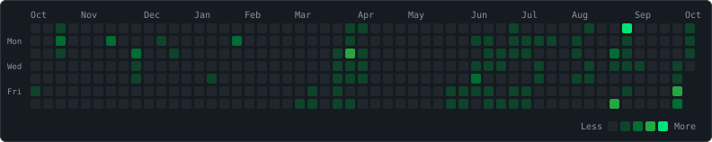

<div align="center">

```text
╔════════════════════════════════════════════════════════╗
║   A D R I E L   B O B B Y   //   CHARACTER SHEET       ║
╚════════════════════════════════════════════════════════╝
```

**Class:** CS Undergrad · Aspiring Security Engineer  
**Guild:** IEEE Technical Coordinator, RSET Kochi  
**Region:** Kalamassery, Kerala, IN

[`$ open adrielbobby.github.io`](https://adrielbobby.github.io)

```text
LVL 05   XP █████████████░░░░░░░░░░░░░░░░░  125 / 290
```

</div>

---

## `> stats --all`

```text
LVL 05  B.Tech CSE · RSET Kochi
────────────────────────────────────────────
PYTHON         ███████░░░  Lv.7
JAVASCRIPT     ███████░░░  Lv.7
REACT          ███████░░░  Lv.7
C              ███████░░░  Lv.7
CYBERSECURITY  █████░░░░░  Lv.5  (Practitioner)
OPENCV / CV    █████░░░░░  Lv.5
LOCAL LLMs     ████░░░░░░  Lv.4  (Training)
────────────────────────────────────────────
```

| Attribute | Domain | Score |
|-----------|--------|:-----:|
| **INT** | AI / Computer Vision | 12 |
| **DEX** | Web / React | 15 |
| **WIS** | Security | 14 |
| **CHA** | Leadership & Coordination | 12 |
| **STR** | Systems / C | 14 |

---

## `> skill-tree --expand`

```text
SKILL TREE
│
├─ LANGUAGES
│  ├─ Python ........... Lv.7  ███████░░░
│  ├─ JavaScript ....... Lv.7  ███████░░░
│  ├─ C ................ Lv.7  ███████░░░
│  ├─ MySQL ............ Lv.7  ███████░░░
│  ├─ TypeScript ....... Lv.3  ███░░░░░░░
│  └─ Lua .............. Lv.2  ██░░░░░░░░
│
├─ WEB
│  ├─ React ............ Lv.7  ███████░░░
│  ├─ HTML5 / CSS3 ..... Lv.7  ███████░░░
│  └─ Vite ............. Lv.6  ██████░░░░
│
├─ SECURITY
│  ├─ Web Security ..... Lv.6  ██████░░░░
│  ├─ Network Security . Lv.6  ██████░░░░
│  ├─ PrivEsc .......... Lv.5  █████░░░░░
│  ├─ Forensics ........ Lv.4  ████░░░░░░
│  ├─ Malware Analysis . Lv.4  ████░░░░░░
│  ├─ Mobile Security .. Lv.4  ████░░░░░░
│  ├─ OSINT ............ Lv.4  ████░░░░░░
│  ├─ Cryptography ..... Lv.3  ███░░░░░░░
│  ├─ Binary Exploits .. Lv.2  ██░░░░░░░░
│  ├─ Blue Team ........ Lv.2  ██░░░░░░░░
│  ├─ Reverse Eng. ..... Lv.0  ░░░░░░░░░░
│  ├─ Secure Coding .... Lv.0  ░░░░░░░░░░
│  └─ Sec. Scripting ... Lv.0  ░░░░░░░░░░
│
├─ AI & VISION
│  ├─ OpenCV ........... Lv.5  █████░░░░░
│  ├─ YOLOv8 ........... Lv.5  █████░░░░░
│  ├─ Streamlit ........ Lv.4  ████░░░░░░
│  └─ Local LLMs ....... Lv.4  ████░░░░░░
│
└─ TOOLS
   ├─ Git / GitHub ..... Lv.6  ██████░░░░
   ├─ Linux CLI ........ Lv.6  ██████░░░░
   └─ Raspberry Pi ..... Lv.2  ██░░░░░░░░
```

---

## `> quest-log`

| Quest | Objective | Loot (Stack) | Status |
|-------|-----------|--------------|:------:|
| [**adrielbobby.github.io**](https://github.com/AdrielBobby/adrielbobby.github.io) | Terminal-themed portfolio with WebGL effects | React · Vite · Three.js | Ongoing |
| [**thaalam**](https://github.com/AdrielBobby/thaalam) | Wearable chenda coach with real-time timing feedback and Malayalam AI instruction. Team project, I built the backend & UI (Best Use of Gemma, Physical AI Hackathon) | Python · FastAPI · Gemma · Raspberry Pi 5 | Complete |
| [**calm-cockpit**](https://github.com/AdrielBobby/calm-cockpit-multipage-version) | Student mission control: timetable, grades, finance, calendar | JavaScript | In progress |
| [**ai-swimming-pool-detection**](https://github.com/AdrielBobby/ai-swimming-pool-detection) | Detect swimming pools in satellite imagery with an interactive dashboard | YOLOv8 · Streamlit | Complete |
| [**pharma-batch-tracker**](https://github.com/AdrielBobby/pharma-batch-tracker) | MedLedger: pharmacy batch & expiry manager with FEFO sales allocation, near-expiry alerts and trigger-enforced stock integrity | Oracle 23ai · Node.js · React · TypeScript · Docker | Complete |
| [**Mend-your-heart-game**](https://github.com/AdrielBobby/Mend-your-heart-game) | A small Valentine's Day game about finding yourself | Lua | Complete |

---

## `> active-quests`

```text
ACTIVE QUESTS
────────────────────────────────────────────
[>] Local LLMs ......... Lv.4 -> Lv.6   build into real apps, edge AI on Pi 5
[>] Cryptography ....... Lv.3 -> Lv.5   reward: CTF crypto challenges
[>] Web & Network ...... Lv.6 -> Lv.7   reward: deeper pentesting
[>] calm-cockpit ....... in progress    reward: ship it

LOCKED  (unlock by levelling up)
────────────────────────────────────────────
[ ] Reverse Eng. ....... Lv.0
[ ] Secure Coding ...... Lv.0
[ ] Sec. Scripting ..... Lv.0
[ ] Binary Exploits .... Lv.2
[ ] Blue Team .......... Lv.2
```

---

## `> achievements --list`

```text
ACHIEVEMENTS
────────────────────────────────────────────
[x] 🦈 Pull Shark           merged pull requests
[x] 👥 Pair Extraordinaire  co-authored commits
[x] ⚡ Quickdraw            closed an issue/PR fast
[x] 🎖️ IEEE Technical Coordinator
[x] 🚩 First CTF            flag captured
[x] 🔐 Security cert        certified
────────────────────────────────────────────
```

```text
$ git log --contributions --graph
```

<p align="center">
  <picture>
    <source media="(prefers-color-scheme: dark)" srcset="contributions-dark.svg">
    <source media="(prefers-color-scheme: light)" srcset="contributions-light.svg">
    
  </picture>
</p>

<p align="center">
  <picture>
    <source media="(prefers-color-scheme: dark)" srcset="https://github-readme-stats.vercel.app/api?username=AdrielBobby&show_icons=true&bg_color=161b22&border_color=30363d&title_color=00e676&icon_color=00e676&text_color=c9d1d9">
    <source media="(prefers-color-scheme: light)" srcset="https://github-readme-stats.vercel.app/api?username=AdrielBobby&show_icons=true&bg_color=f6f8fa&border_color=d0d7de&title_color=00a152&icon_color=00a152&text_color=24292f">
    
  </picture>
  <picture>
    <source media="(prefers-color-scheme: dark)" srcset="https://github-readme-streak-stats.herokuapp.com/?user=AdrielBobby&background=161b22&border=30363d&ring=00e676&fire=00e676&currStreakNum=c9d1d9&sideNums=c9d1d9&currStreakLabel=00e676&sideLabels=8b949e&dates=8b949e&stroke=30363d">
    <source media="(prefers-color-scheme: light)" srcset="https://github-readme-streak-stats.herokuapp.com/?user=AdrielBobby&background=f6f8fa&border=d0d7de&ring=00a152&fire=00a152&currStreakNum=24292f&sideNums=24292f&currStreakLabel=00a152&sideLabels=57606a&dates=57606a&stroke=d0d7de">
    
  </picture>
</p>

---

## `> contact --open`

```text
$ ping adriel
  portfolio : https://adrielbobby.github.io
  github    : https://github.com/AdrielBobby
  status    : open to internships & security / AI projects
```

<div align="center"><sub>[ press any key to continue ]</sub></div>
